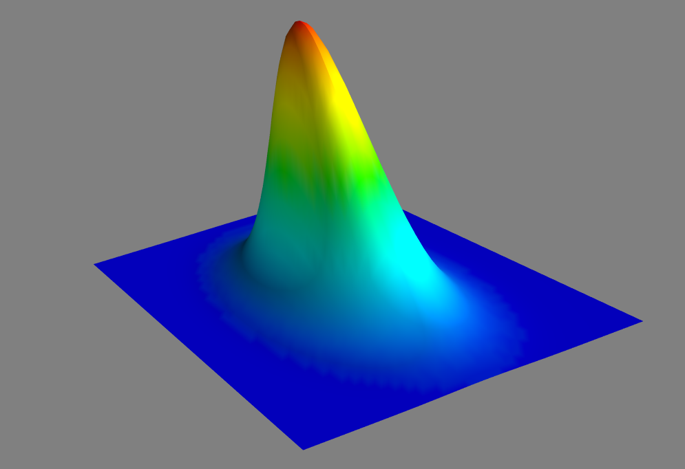
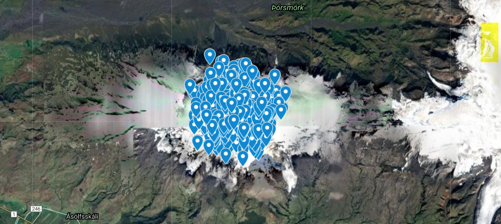

# GPS coordinate bi-normal distribution generation with same dispersion in distance for latitude and longitude

## Distances in a spherical coordinate system

Earth's circumference about 40.000 km. For a given longitude, 1 degree of latitude is 360 times less : about 111 km. But for a given latitude it depends. Along a parallel of latitude the distance corresponding to 1 degree of longitude is 111*cos(latitude).

## Equal dispersion in distance in all directions

We want to generate location data that are centered on a given location on Earth. We want the data with bi-normal distribution no matter the direction.

We want a *circular normal distribution*

In Python, we can use NumPy multivariate_normal to achieve this.

We just need to provide appropriate covariance matrix.

    cov = [ [ s1², 0],
            [ 0, s2² ] ]

s1² is the variance relatively to first axis. The scalar sigma s1 being standard deviation.
As we are interested in a circular distribution, we'll directly consider a diagonal matrix.

In  Cartesian coordinate system, to achieve a circular-based shape we would choose s2=s1.  

In spherical coordinate system (latitude, longitude), we can compensate the projection by providing a larger s2.

    s2 = sigma/np.cos( np.radians(self.center.latitude))

As a result the 3D mesh denotes a stretched shape : longitude being stretched.

Displaying corresponding points on a map we can notice than we do have a true circular-based distribution.

[1000 points bi-normal distribution centered on vocano Eyjafjallajökull](https://www.google.com/maps/d/edit?mid=1fH4903juMFYd0I-s3bPyMMDDeF1gLjpo)

Exactly what we were looking for.